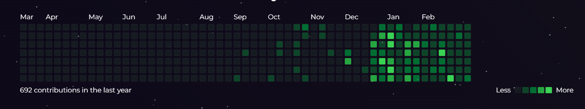

# React GitHub Contributions

A React component to display a GitHub contributions graph based on
[`react-activity-calendar`](https://github.com/grubersjoe/react-activity-calendar).




## Installation

```shell
npm install react-github-contributions
```

## Development-Demo

```
import GitHubContributions from "react-github-contributions"

// ... in your render() method:

<GitHubContributions username="{your username}"/>
```

## Example in .jsx

```bash
import React from 'react';
import { render } from 'react-dom';
import { GitHubContributions } from 'react-github-contributions';

const App = () => {
  return (
    <div className="App">
      <GitHubContributions
        username="your-github-username"
        config={{
          contributionsPerPage: 10,
          theme: 'light',
        }}
      />
    </div>
  );
};

render(<App />, document.getElementById('root'));
```

## License
This package is licensed under Apache-2.0

Happy Coding💻😎